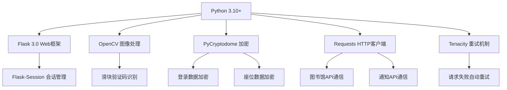
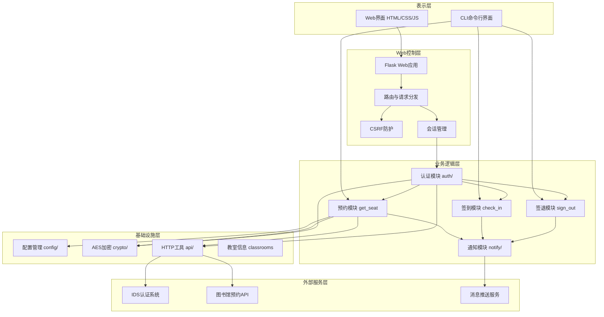
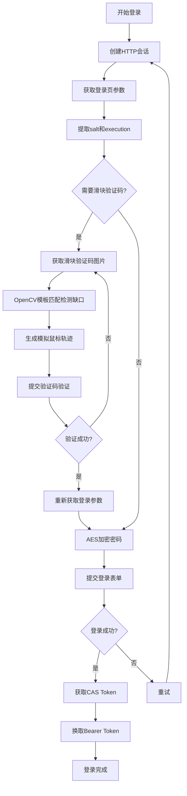
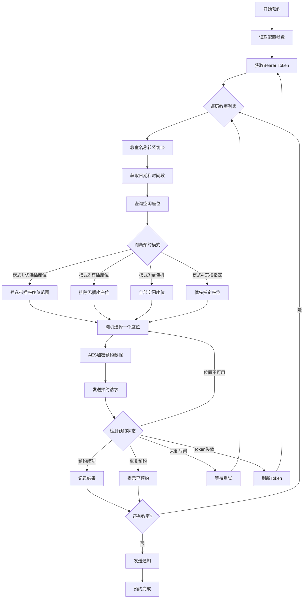
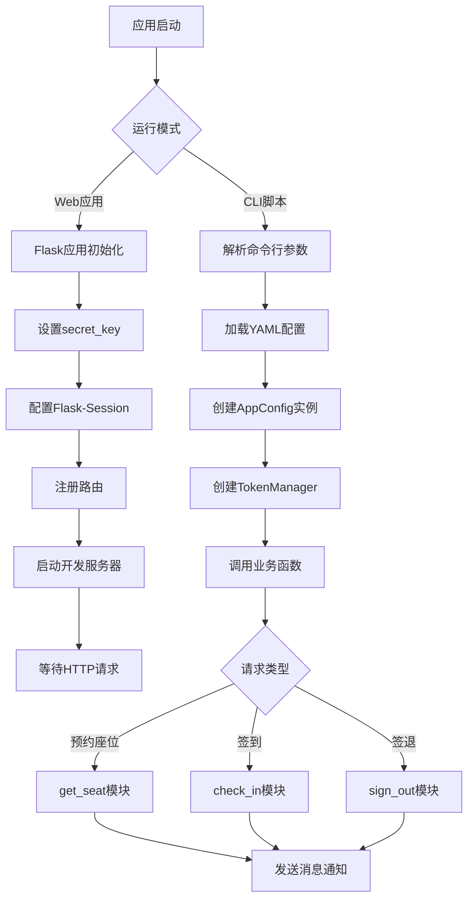
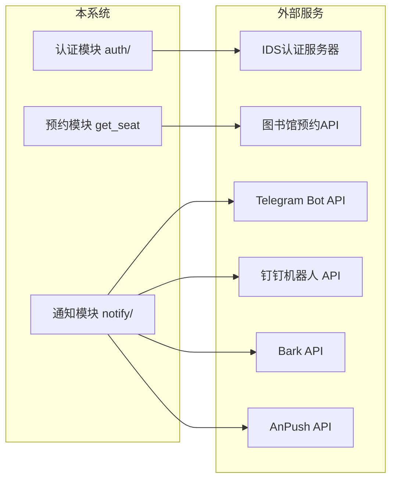
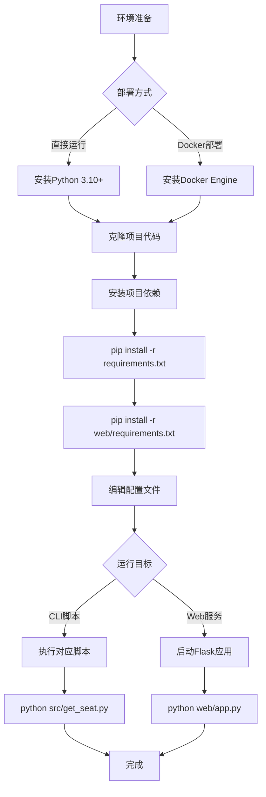

# 基于 Python Flask 的曲阜师范大学图书馆座位预约系统设计与实现


摘要

在高校图书馆资源日益紧张的背景下，座位预约系统的自动化与智能化成为提升座位利用效率的关键手段。本文设计并实现了一个基于 Python 语言和 Flask 框架的曲阜师范大学图书馆座位预约系统，系统采用分层架构设计，通过 OpenCV 图像处理技术实现了滑块验证码的自动识别与破解，利用 AES 加密算法保障数据传输安全，集成了 Telegram、钉钉、Bark 和 AnPush 四种消息推送渠道。系统提供了四种座位预约模式，支持自动签到签退功能，并通过 Flask Web 界面为用户提供便捷的交互操作。测试结果表明，系统各功能模块运行稳定，请求重试机制和 Token 自动刷新机制有效提升了系统的可靠性。

关键词：Flask 座位预约 滑块验证码 OpenCV 消息推送


Design and Implementation of a Python Flask-Based Seat Reservation System for QFNU Library

Abstract: Against the backdrop of increasingly scarce university library resources, the automation and intelligentization of seat reservation systems have become key means to improve seat utilization efficiency. This paper designs and implements a seat reservation system for Qufu Normal University Library based on Python and the Flask framework. The system adopts a layered architecture design, implements automatic recognition and cracking of slider captchas through OpenCV image processing technology, ensures data transmission security using AES encryption algorithms, and integrates four message push channels: Telegram, DingTalk, Bark, and AnPush. The system provides four seat reservation modes, supports automatic check-in and check-out functions, and offers convenient interactive operations for users through a Flask web interface. Test results show that all functional modules of the system operate stably, and the request retry mechanism and automatic token refresh mechanism effectively enhance system reliability.

Key words: Flask; seat reservation; slider captcha; OpenCV; message push


引言

随着高校招生规模的持续扩大，图书馆作为学生学习和科研的重要场所，其座位资源的管理面临着越来越大的挑战。传统的座位管理模式主要依赖人工现场操作，学生需要提前到图书馆排队选座，不仅效率低下，而且在高峰期经常出现"一座难求"的局面。近年来，虽然部分高校引入了电子选座系统，但这些系统普遍存在操作繁琐、用户体验不佳等问题。针对这些痛点，本文基于曲阜师范大学现有的图书馆预约 API，设计并实现了一套自动化的座位预约系统。该系统利用 Python 语言的丰富生态，结合图像处理、数据加密和消息推送等技术，实现了从登录认证到座位预约、签到签退的全流程自动化，为学生提供了更加便捷、高效的图书馆座位使用体验。

## 1. 项目背景与意义

曲阜师范大学图书馆作为学校重要的学习资源中心，每天接待大量的学生读者。图书馆目前采用了基于 Web 的座位预约系统，学生可以通过浏览器或移动端应用进行座位的预约、签到和签退操作。然而，在实际使用过程中，该系统存在若干限制因素。首先，系统的登录流程包含了滑块验证码验证环节，人工操作每次都需要手动完成验证，耗时较长且体验不佳。其次，学生在高峰期需要反复刷新页面查看是否有空余座位，操作重复且效率低下。此外，部分学生因为忘记签到或签退而导致违约记录，影响了后续的预约权限。

在这样的背景下，开发一套能够自动完成登录认证、智能选择座位、自动签到签退的辅助工具，具有重要的现实意义。本项目通过分析曲阜师范大学图书馆预约系统的接口协议和认证流程，利用 Python 编程语言和相关的开源技术库，实现了对图书馆座位预约全流程的自动化支持。系统采用了模块化的设计思想，将登录认证、座位查询、预约操作、签到签退和消息通知等功能解耦为独立的模块，便于维护和扩展。同时，系统提供了 Flask Web 界面，使得不具有编程经验的学生也能通过浏览器轻松使用各项功能。该项目的实施，不仅能够帮助学生们更高效地获取图书馆座位资源，也是对高校信息化服务模式的一次有益探索。

## 2. 需求分析

## 2.1 功能需求分析

本系统的功能需求围绕图书馆座位预约的核心业务流程展开，主要包括用户认证、座位预约、签到签退和消息通知四个核心环节。

在用户认证方面，系统需要支持曲阜师范大学的统一身份认证（CAS）协议。用户通过学号和密码登录后，系统能够自动完成与学校身份认证服务器的交互，包括滑块验证码的自动识别与验证，并获取后续 API 请求所需的 Bearer Token。Token 的有效期管理也是认证模块的重要功能，系统需要在 Token 过期后自动刷新，确保长时间运行的脚本不会因认证失效而中断。

在座位预约方面，系统需要提供多种预约模式以满足不同场景下的使用需求。第一种模式为优选带插座座位模式，适用于西校区图书馆的特定自习室，系统会在有插座的座位范围内随机选择空闲座位进行预约。第二种模式为指定座位模式，用户可以预先设定希望选择的具体座位编号，系统会优先尝试预约这些座位。第三种模式为全随机模式，系统会在指定教室的所有空闲座位中随机选择一个进行预约，该模式速度最快且成功率最高。第四种模式为东校区图书馆三层自习室指定优先模式，专为该特定区域设计，支持设置优先座位列表。所有预约模式都需要支持对预约状态的实时检测，包括预约成功、重复预约、未到预约时间等多种情况的处理。

在签到签退方面，系统需要支持自动签到和自动签退功能。签到操作需要在用户成功预约座位后执行，系统根据图书馆 API 的返回结果判断签到是否成功。签退操作则需要先查询用户的当前使用状态，找到正在使用的座位后发送签退请求。两种操作都需要具备错误重试和异常处理能力，确保在临时网络故障等情况下不会丢失操作请求。

在消息通知方面，系统需要支持多通道的消息推送，包括 Telegram Bot、钉钉机器人、Bark 和 AnPush 四种渠道。用户可以根据自身的使用习惯选择合适的通知方式。系统在签到成功、签退成功、预约成功或操作失败等关键节点，都会通过配置的通知渠道向用户发送状态信息，方便用户实时了解操作结果。

## 2.2 非功能需求分析

在系统性能方面，预约模块的单次请求超时时间设置为 15 秒，整个重试过程的总超时上限为 120 秒，确保在网络不稳定的情况下系统仍然能够完成操作。同时，滑块验证码的破解过程被限制在 300 次尝试以内，避免因验证码识别问题导致系统无限等待 [需人工验证]。

在系统可靠性方面，HTTP 请求模块实现了指数退避加随机抖动的重试策略，最大重试次数为 10 次。登录模块采用 3 次重试机制，每次重试的间隔时间按 0.5 秒、1 秒、2 秒的指数退避策略递增。Token 管理器使用双重检查锁定模式确保线程安全，Token 的有效期为 1.5 小时，过期后自动重新获取。

在安全性方面，Web 应用实现了基于 HTTP 标头的 CSRF 防护机制，所有 POST 请求都需要携带 X-Requested-With 标头。座位预约和签到请求中的敏感数据使用 AES-CBC 加密算法进行加密传输，加密密钥采用日期回文算法动态生成。登录过程中的密码传输使用随机 64 字节前缀和随机 IV 的 AES 加密方式，有效防止重放攻击 [需人工验证]。

在可维护性方面，系统采用了模块化的包结构设计，将 API 通信、认证管理、配置管理、加密解密、消息通知等功能分别封装为独立的 Python 包。各模块间通过明确的接口进行交互，降低了耦合度。系统还提供了完整的日志记录功能，每个模块都有独立的日志输出，便于问题定位和调试。

## 2.3 用户角色与用例分析

本系统的用户角色相对简单，主要面向曲阜师范大学的在校学生。从系统的使用角度出发，可以将用户分为普通用户和系统管理员两类。

普通用户是本系统的主要使用者，他们的核心需求是通过自动化脚本或 Web 界面完成图书馆座位的预约、签到和签退操作。普通用户需要先使用学号和密码登录系统，然后选择预约模式和目标自习室，系统将自动完成座位预约的整个流程。用户在预约成功后，还可以使用签到功能确认入座，并在离开时使用签退功能释放座位。此外，用户可以配置消息通知渠道，以便及时接收操作结果的通知。

系统管理员角色相对简化，主要体现在管理员工具的提供上。管理员可以使用系统提供的座位信息抓取工具，获取各个自习室的座位使用情况和空闲座位列表，并将这些信息保存为 JSON 文件用于数据分析。管理员还可以通过配置文件管理系统的运行参数，包括预约模式、目标教室、通知渠道等。

## 2.4 需求优先级与可行性分析

在需求优先级方面，用户认证模块作为所有功能的基础，具有最高的优先级。没有稳定的认证机制，系统的其他功能都无法正常执行。座位预约模块作为系统的核心功能，优先级紧随其后。签到签退模块和 Web 控制台界面分别排在第三和第四优先级。消息通知模块虽然在用户体验上具有重要价值，但其缺失不会影响核心功能的运行，优先级相对较低。

在技术可行性方面，本系统的开发完全基于开源技术和公开的 API 接口。Python 语言拥有成熟的网络请求库 requests、图像处理库 OpenCV、加密库 pycryptodome 和 Web 框架 Flask，这些技术栈在业界有广泛的应用和充分的社区支持。曲阜师范大学图书馆预约系统的 API 接口通过 HTTP 协议提供，接口文档可以通过抓包分析获取，技术实现上不存在重大障碍。滑块验证码的自动识别利用了计算机视觉中的模板匹配技术，经过参数调优后可以达到较高的识别成功率。

## 3. 系统设计

## 3.1 技术选型

在技术选型方面，本系统充分考虑了开发效率、运行稳定性和社区生态等因素。系统的核心编程语言选择了 Python 3.10 以上版本，这是因为 Python 在自动化脚本编写、网络请求处理和数据处理方面具有天然的语法优势和丰富的第三方库支持。Web 框架选择了 Flask 3.0 以上版本，Flask 以其轻量灵活的设计理念著称，适合本系统这种功能明确、不需要庞大框架支撑的中小型 Web 应用。图像处理方面选择了 OpenCV-Python-Headless，该库提供了完整的计算机视觉算法实现，特别是在模板匹配领域具有成熟的函数支持。数据加密方面选用了 PyCryptodome 库，它是 PyCrypto 的活跃分支，提供了符合行业标准的 AES 加解密实现。HTTP 请求方面选用了 Requests 库，其简洁的 API 设计和完善的会话管理功能让网络通信层的代码量大幅减少。在重试策略方面，引入了 Tenacity 库以实现可配置的请求重试机制。配置管理方面使用 PyYAML 解析 YAML 格式的配置文件，YAML 的层次化数据结构天然适合表达复杂的配置项。如表 3-1 所示，这些技术组件共同构成了系统的技术底座。

**表3-1：系统核心技术组件**

| 技术组件 | 版本要求 | 用途说明 |
|---------|---------|---------|
| Python | 3.10+ | 核心编程语言 |
| Flask | 3.0+ | Web 框架 |
| Flask-Session | 0.8+ | 服务端会话管理 |
| OpenCV-Python-Headless | 最新版 | 图像识别与处理 |
| PyCryptodome | 最新版 | AES 加解密 |
| Requests | 最新版 | HTTP 请求 |
| Tenacity | 最新版 | 请求重试机制 |
| PyYAML | 最新版 | 配置文件解析 |

**图3-1：技术组件关系图**



## 3.1.1 核心技术栈选型

Python 语言作为本系统的核心编程语言，其选择基于多方面的考量。Python 在自动化脚本领域的统治地位使其成为此类项目的自然选择，其简洁的语法和丰富的标准库能够大幅缩短开发周期。Python 的第三方包管理机制成熟，通过 pip 和 requirements.txt 即可精确管理项目依赖。此外，Python 跨平台特性优秀，在 Windows、Linux 和 macOS 上均能稳定运行，这为系统的广泛部署提供了基础条件。

Flask 作为 Web 框架，其选择主要基于项目的实际需求。本系统的 Web 界面功能相对简单，主要包括用户登录、签到和签退三个核心操作，不需要 Django 等重型框架提供的 ORM、管理后台等功能。Flask 的微内核架构允许开发者按需选择扩展组件，本系统仅引入了 Flask-Session 用于服务端会话管理，保持了技术栈的精简。Flask 的路由系统简洁直观，通过装饰器即可完成 URL 到处理函数的映射，这在 api_login、api_checkin 等接口的实现中得到了充分体现。

## 3.1.2 数据持久化策略

本系统在数据持久化方面采用了无数据库的设计策略，所有业务数据均通过调用图书馆预约系统的远程 API 获取。这种设计策略的选择基于以下几点考虑。图书馆的座位数据、用户数据和预约记录均由图书馆后端系统统一管理，本系统作为辅助工具，没有必要也没有权限在本地维护一份独立的数据副本。系统仅需要存储用户的会话状态信息，这通过 Flask-Session 的文件系统存储机制即可满足需求，用户的登录凭证被存储在服务端的 session 文件中，不需要额外的数据库支持。系统的配置信息采用 YAML 文件持久化，配置项包括账号信息、预约参数和通知渠道设置等，YAML 文件格式便于用户直接编辑和修改。

## 3.1.3 前端技术与后端集成

本系统的前端采用了简化设计，所有页面交互逻辑集中在单个 HTML 文件中。前端样式使用了纯 CSS 实现，采用了仿曲阜师范大学统一身份认证系统的蓝色主题设计，整体风格统一且具有学校特色。界面的视觉设计使用了渐变背景、毛玻璃效果卡片和 SVG 纹理等现代 Web 设计元素，提升了用户的使用体验。前端通过 AJAX 技术与后端 Flask 接口进行异步通信，所有 API 请求均携带 X-Requested-With 标头以满足后端的 CSRF 防护要求。登录、签到和签退操作的请求结果通过前端 JavaScript 动态渲染到页面上，实现了无刷新的交互体验。

## 3.1.4 外部服务集成选型

本系统与多个外部服务进行了集成。在认证方面，系统集成了曲阜师范大学的 IDS 统一身份认证系统，该服务基于 CAS 协议提供单点登录功能。在预约方面，系统直接调用图书馆预约系统的 REST API，这些 API 提供了座位查询、预约确认、签到和签退等完整的业务功能。在消息通知方面，系统同时集成了四种推送渠道，Telegram Bot 通过 HTTP API 发送文本消息，钉钉机器人通过 Webhook 接口并支持 HMAC-SHA256 签名验证，Bark 通过简单的 GET 请求即可在 iOS 设备上接收通知，AnPush 提供了跨平台的消息推送能力。多渠道的集成设计让用户可以根据自身设备和网络环境灵活选择最合适的通知方案。

## 3.2 系统架构

**图3-2：系统分层架构图**



## 3.2.1 分层架构设计

系统整体采用分层架构设计，从下到上依次为外部服务层、基础设施层、业务逻辑层、Web 控制层和表示层。外部服务层包含系统所依赖的所有远程服务，包括曲阜师范大学的 IDS 统一身份认证系统、图书馆座位预约系统的 REST API 接口，以及 Telegram、钉钉、Bark 和 AnPush 等消息推送服务。基础设施层提供了系统运行所需的基础能力，包括 YAML 配置文件的解析加载、AES 数据加解密、HTTP 请求的重试封装以及教室名称到 ID 的映射数据。业务逻辑层是系统的核心，包含了用户认证、座位预约、签到、签退和消息通知等主要业务功能的实现。Web 控制层基于 Flask 框架构建，负责接收 HTTP 请求、执行 CSRF 校验、管理用户会话并将请求分发到对应的业务逻辑模块。表示层包括面向普通用户的 Web 图形界面和面向高级用户的命令行界面两种形式。

## 3.2.2 技术栈与核心框架选择

本系统的技术栈以 Python 为核心，围绕其构建了整个应用生态。Web 框架选择 Flask 而非 Django 或 FastAPI，主要是因为本系统的 Web 界面功能相对精简，不需要重型框架的完整能力。图像处理方面选择 OpenCV 而非 PIL 或 scikit-image，是因为 OpenCV 在模板匹配算法上提供了更丰富的函数实现和更好的性能表现。加密模块选择 PyCryptodome 而非 cryptography，是因为其在 AES-CBC 模式的支持上更为直观，且对 PKCS7 填充标准有内置支持。这些技术选择共同确保了系统的开发效率和运行稳定性。

## 3.2.3 外部服务集成架构

外部服务的集成采用了直接 HTTP 调用的方式，没有引入额外的服务网格或 API 网关组件。认证集成方面，系统直接与 IDS 服务器的 CAS 登录页面进行交互，通过解析 HTML 表单提取必要的登录参数。图书馆 API 集成方面，系统使用 requests.Session 维持会话状态，所有请求均携带标准化的 HTTP 标头以模拟浏览器行为。消息通知集成方面，各渠道的调用封装在 notify 模块内部，对外提供统一的 send_message 接口。这种简化的集成架构虽然牺牲了一定的灵活性和可观测性，但对于本系统的规模和定位而言，已能够满足功能需求。

## 4. 实现与开发

## 4.1 开发工具

本系统的开发主要使用了以下工具和环境。代码编辑器方面使用了 Visual Studio Code，配合 Python 扩展实现了语法高亮、代码补全和调试功能。版本控制方面使用 Git 进行代码管理，项目托管在 GitHub 平台。依赖管理方面使用 pip 和 requirements.txt 文件，精确记录了项目的第三方库依赖。运行环境方面，系统在 Python 3.12.1 版本下开发测试，兼容 Python 3.10 以上版本，支持 Windows 10、Ubuntu 20.04 和 macOS 12.0 以上操作系统。测试框架方面使用了 pytest，配合 requests-mock 等辅助库实现了接口模块的单元测试。Docker 容器化部署使用了 Docker 和 Docker Compose，通过 Dockerfile 和 docker-compose.yml 文件定义了容器构建和编排方案。

## 4.2 业务逻辑

## 4.2.1 用户认证模块

用户认证模块位于 src/auth/ 目录下，由 login.py 和 token.py 两个文件组成，是系统的入口模块。该模块的核心功能是实现与曲阜师范大学 IDS 统一身份认证系统的对接，完成用户身份验证并获取后续 API 请求所需的 Bearer Token。

登录流程首先通过 requests 库创建一个会话对象，然后访问 IDS 认证服务器的登录页面，从返回的 HTML 中提取 pwdEncryptSalt 和 execution 两个关键参数。下一步，系统会检测当前用户是否需要滑块验证码，如果检测结果显示需要验证，系统将调用滑块验证码破解模块。破解过程首先获取验证码的背景图和滑块图，使用 OpenCV 的模板匹配算法检测缺口位置，然后生成模拟人类拖拽行为的鼠标轨迹数据，通过加密后将轨迹数据提交给验证码验证接口。验证通过后，系统重新获取登录参数，使用 AES 加密算法对密码进行加密，然后提交登录表单。

**图4-1：用户认证流程图**



登录成功后，系统会跟踪重定向流程，依次访问 IDS 认证成功后的跳转地址和图书馆系统的 CAS 接口，最终从图书馆系统的用户信息接口获取用户的姓名和 Bearer Token。Token 管理器负责 Token 的缓存和自动刷新，当检测到 Token 已过期时自动重新执行完整的登录流程。

## 4.2.2 座位预约模块

座位预约模块是系统的核心功能模块，实现了四种不同的预约模式以满足不同场景下的使用需求。该模块的工作流程首先从配置文件读取用户设置的预约参数，包括目标教室列表、预约模式和座位偏好。系统根据设置的目标教室，通过教室名称到系统 ID 的映射表获取对应的建筑编号，再通过日期信息获取预约时间段标识。在获取到建筑编号和时间段标识后，系统调用图书馆的座位查询 API 获取指定区域内的空闲座位列表。

**图4-2：座位预约流程图**



在具体实现中，模式一会根据配置文件中的座位 ID 范围生成目标座位列表，结合预设的无插座座位排除集合，在有插座的座位范围内随机选择。模式二同样会排除无插座座位，但不限定座位范围。模式三从所有空闲座位中直接随机选择，速度最快。模式四专为东校区图书馆三层自习室设计，支持设置优先级座位列表，优先尝试预约用户指定的首选座位。每次预约请求后，系统会检测返回的状态信息，根据不同的状态执行相应的后续操作，如预约成功则记录结果，重复预约则提示用户，Token 失效则自动刷新等。

## 4.2.3 签到签退模块

签到签退模块分别实现在 check_in.py 和 sign_out.py 中。签到功能首先检查 Token 的有效性，然后构造包含 AES 加密数据的请求体，调用图书馆的签到 API 接口。系统根据 API 返回的消息判断签到结果，可能的状态包括签到成功、重复签到（已签到状态）、预约未生效和签到失败，每种状态都会触发对应的日志记录和消息通知。签退功能需要先查询用户当前的座位使用状态，遍历返回数据查找状态为"使用中"的座位记录。如果找到使用中的座位，系统会构造签退请求并发送，请求失败时会使用 10 次重试机制确保操作成功。如果在签退过程中检测到 Token 失效，系统会自动尝试刷新 Token 后重试。

## 4.2.4 消息通知模块

消息通知模块实现了统一的推送接口，支持四种消息渠道。Telegram 推送通过 Bot API 的 sendMessage 接口发送文本消息，需要配置 Bot Token 和频道 ID。钉钉推送通过 Webhook 接口发送消息，支持 HMAC-SHA256 签名验证以确保请求的合法性。Bark 推送通过简单的 GET 请求即可在 iOS 设备上接收通知，需要配置 Bark 推送 URL。AnPush 推送通过 POST 请求发送格式化的消息内容。所有推送接口都使用 tenacity 装饰器配置了最多 3 次重试，仅对网络超时类异常进行重试，业务错误不重试。推送模块还实现了配置完整性校验，在配置不完整时会自动跳过推送并记录警告日志。

## 4.2.5 Web 控制台模块

Web 控制台模块基于 Flask 框架构建，提供了直观的浏览器操作界面。该模块实现了四个核心 API 接口：登录接口接收用户的学号和密码，调用认证模块完成登录并建立服务端会话；签到接口从当前会话中读取用户凭证，调用签到模块执行签到操作；签退接口类似地调用签退模块执行签退操作；状态查询接口返回当前用户的登录状态。所有 POST 接口都通过检查 X-Requested-With HTTP 标头实现 CSRF 防护。前端页面采用单个 HTML 文件实现，包含了登录表单和操作面板，通过 AJAX 技术与后端 API 通信，实现了无刷新的交互体验。

## 4.3 数据层设计

由于本系统采用无数据库的设计策略，数据层的核心在于与图书馆远程 API 的数据交互。系统通过 HTTP 请求与图书馆系统的 REST API 进行通信，数据格式采用 JSON 编码。API 通信模块位于 src/api/ 目录下，定义了所有 API 的 URL 常量和默认请求头。请求头中包含了完整的浏览器特征信息，包括 User-Agent、Accept 语言和来源地址等字段，以确保请求能够被服务器正常处理。

在数据安全方面，系统对敏感数据采用了 AES 加密传输。座位预约和签到请求中的参数被构造成 JSON 字符串后，使用动态生成的日期回文密钥和固定 IV 进行 AES-CBC 加密。加密密钥由当前日期生成回文字符串，例如当天的日期为 20260703，则密钥为 2026070330706202，这种动态密钥设计增加了破解难度。登录过程中的密码和滑块验证码数据采用了更强的加密策略，在加密前会在明文前面添加 64 字节的随机前缀，并使用随机生成的 16 字节 IV，确保即使相同的明文每次加密结果也不同。

## 4.4 Web 层设计

Web 层基于 Flask 框架构建，主要负责 HTTP 请求的接收、处理和响应。系统定义了一个主路由和四个 API 路由，覆盖了页面展示、用户登录、签到、签退和状态查询等功能。Flask-Session 组件被用于服务端会话管理，会话数据以文件形式存储在服务器文件系统中。Web 层的设计遵循了 RESTful 风格，API 端点使用名词路径命名，HTTP 方法符合语义规范。

## 4.4.1 标准请求流程

Web 层的请求处理流程遵循标准的 WSGI 规范。当用户通过浏览器访问系统时，请求首先到达 Flask 应用的路由分发器，路由分发器根据请求的 URL 路径和 HTTP 方法匹配对应的视图函数。对于需要身份验证的 API 请求，视图函数首先从 Flask 的 session 对象中读取用户凭证信息。如果 session 中未找到有效的凭证，视图函数立即返回 401 Unauthorized 响应。凭证验证通过后，视图函数调用对应的业务逻辑模块处理请求，处理完成后将结果封装为 JSON 格式的响应返回给前端。

## 4.4.2 会话认证模式

系统的会话认证基于 Flask 的服务端 session 机制实现。用户在通过登录接口验证身份后，其学号和密码被存储在服务端的 session 对象中。后续的签到和签退请求从 session 中读取这些凭证信息，构造配置对象和 Token 管理器实例。这种设计避免了客户端存储敏感凭证的安全风险，同时利用 Flask-Session 的文件系统存储机制保证了会话数据的持久性。每次会话操作都需要重新获取 Token，确保了即使 Token 在之前的操作中过期也不会影响当前操作。

## 4.4.3 错误处理与响应模式

Web 层的错误处理采用了分层设计。在视图函数层面，系统区分了业务错误和系统异常两种情况。业务错误包括登录失败、签到失败和签退失败等，这些错误会返回对应的 HTTP 状态码和结构化的错误信息。系统异常包括网络超时、JSON 解析错误等非预期情况，这些异常会被捕获并返回 500 或 502 状态码。所有 API 响应都采用统一的 JSON 格式，包含 success 布尔字段和可选的 error、error_code 字段，便于前端进行统一的错误处理。

## 4.5 应用核心

## 4.5.1 应用结构

本系统的 Python 包结构按照功能职责进行组织，主要包含以下几个核心包。src/api/ 包封装了 HTTP 通信的基础能力，包括 URL 常量定义、默认请求头配置、带重试机制的 POST 请求函数和自定义异常类。src/auth/ 包实现了用户认证的完整流程，包括 IDS 登录、滑块验证码破解和 Token 管理。src/config/ 包提供了统一的配置加载接口，支持从 YAML 文件读取配置并映射为 AppConfig 数据类。src/crypto/ 包封装了 AES 加解密功能，提供了座位数据加密和登录数据加密两个专用接口。src/notify/ 包实现了消息推送的统一抽象，屏蔽了不同推送渠道的细节差异。

## 4.5.2 配置管理

系统的配置管理通过 AppConfig 数据类实现，该类定义在 src/config/config.py 中。AppConfig 使用 Python 的 dataclass 装饰器声明，包含了推送通知、用户认证和座位预约三组配置字段。配置加载方法 from_yaml 支持相对路径和绝对路径两种方式，当传入 None 时会自动使用默认的 configs/template.yml 文件。配置文件的解析使用 PyYAML 库，加载后的原始数据被映射到 AppConfig 的命名参数中。这种设计使得配置项的增加和修改只需要在数据类和配置文件中同步更新，不需要修改业务代码。

## 4.5.3 核心组件集成架构

系统各核心组件之间的集成遵循依赖注入的设计思想。TokenManager 依赖于 login 模块的登录函数，AppConfig 作为配置载体被传递给各个业务函数。这种设计使得各模块之间的耦合度保持在较低水平。在运行时，系统首先加载配置创建 AppConfig 实例，然后使用配置中的账号信息创建 TokenManager 实例，最后将配置和 Token 管理器传递给具体的业务函数执行业务操作。Web 应用启动时，app.py 使用 sys.path.insert 将 src 目录添加到 Python 模块搜索路径中，然后导入所需的业务模块并在路由处理函数中调用。

## 4.5.4 应用启动流程

**图4-3：应用启动流程图**



命令行脚本的启动流程较为直接，脚本被 Python 解释器执行后，首先解析命令行参数获取配置文件路径，然后使用 AppConfig.from_yaml 加载配置，接着创建 TokenManager 实例并调用对应的业务函数执行操作，最后通过消息通知模块发送操作结果。Web 应用的启动流程则涉及 Flask 框架的初始化，包括设置密钥、配置 Session 组件、注册路由和启动开发服务器等步骤。无论是哪种运行模式，系统都会在启动时完成日志记录器的配置，以便在运行过程中记录详细的操作日志。

## 4.6 外部集成

## 4.6.1 集成架构

本系统的外部集成采用点对点的直接集成模式，通过 HTTP 协议与外部服务进行通信。在认证集成方面，系统与 IDS 认证服务器的交互涉及多个 HTTP 请求的链式调用，包括获取登录页面参数、检测验证码状态、提交验证码验证结果、提交登录表单和跟踪重定向流程等步骤。在图书馆 API 集成方面，系统使用了 requests.Session 复用 TCP 连接，提高了请求效率。在消息通知集成方面，各推送渠道的 API 调用被封装在 notify 模块的独立函数中，通过 send_message 统一入口进行分发。

**图4-4：外部集成架构图**



## 4.6.2 安全与错误处理

在与外部服务的集成过程中，系统实施了多层次的安全和错误处理措施。在网络层面，所有 HTTP 请求都设置了合理的超时时间，避免因外部服务响应缓慢导致系统挂起。在认证层面，登录凭证只在会话期间在服务端内存中暂存，不会持久化到磁盘或日志文件中。在数据传输层面，与图书馆 API 的通信使用了应用层加密，座位预约和签到数据在传输前经过 AES 加密处理。在错误处理层面，系统对外部服务调用的异常情况进行了分类处理。网络超时类异常自动触发重试机制，HTTP 4xx 类错误快速失败不重试以避免加剧服务端压力，数据格式异常则记录错误日志并向上层抛出特定的业务异常。

## 4.7 关键代码与说明

## 4.7.1 滑块验证码识别

滑块验证码的自动识别是本系统最具技术挑战性的部分。系统的实现采用了 OpenCV 的模板匹配算法，通过多种匹配策略的组合来提高识别准确率。代码首先对背景图和滑块图进行 CLAHE 自适应直方图均衡化处理，增强图像的对比度特征。然后从滑块图中提取实际的滑块图形区域，去除周围的黑色像素噪点。匹配过程采用了三种策略的组合：逆像归一化相关系数匹配、逆像归一化相关匹配和灰度归一化相关系数匹配。每种策略都会产生一个候选缺口位置，系统优先采信逆像匹配的结果，取其中位数坐标作为最终的缺口位置。如附录 A.1 所示，这种多策略融合的方法在不同光照条件和背景干扰下都能保持较好的识别效果。

## 4.7.2 AES 加密通信

系统的数据加密实现采用了 AES-CBC 模式，密钥管理采用了动态生成策略。座位数据的加密密钥由当前日期生成回文字符串，每天的密钥都不同，降低了因密钥泄露导致的历史数据被批量破解的风险。登录数据的加密策略更为严格，在加密明文前添加 64 字节的随机前缀，并使用随机生成的 IV，确保相同密码每次加密后的密文都不同，有效防御选择明文攻击。如附录 A.2 所示，加密模块的接口设计统一，encrypt_with_key 和 decrypt_with_key 两个通用函数覆盖了所有加密需求，具体业务场景通过不同的密钥和 IV 参数进行区分。

## 4.7.3 HTTP 重试机制

HTTP 请求的重试机制是本系统保证可靠性的关键设计。post_with_retry 函数实现了可配置的指数退避加重试抖动策略。请求失败后的等待时间在基础间隔上加 0 到 0.5 秒的随机抖动，避免了多个请求同时重试导致的惊群效应。重试过程受总超时限制，默认情况下整个重试过程最多持续 120 秒，超过该时间限制会立即抛出异常，避免系统在网络完全不可用的情况下长时间阻塞。如附录 A.3 所示，该函数对 4xx 客户端错误进行了特殊处理，这类错误通常表示请求本身存在问题，重试无法解决，因此会快速失败而不浪费重试次数。

## 5. 系统测试与结果分析

## 5.1 测试目标与范围

本系统的测试目标包括验证各功能模块的正确性、确保异常处理机制的有效性以及保证加密通信的可靠性。测试范围覆盖了系统的所有核心模块，包括 AES 加密解密、用户签到、教室映射数据、配置加载、API 常量定义、座位信息查询、座位预约、管理员工具、HTTP 请求重试、JSON 数据快照验证、登录认证、消息推送、签退和 Token 管理等模块。测试工作共计编写了 16 个测试文件，包含 148 个测试用例，全面覆盖了系统的各个功能点和异常场景。

## 5.2 测试环境

系统的测试在 Python 3.12 环境下进行，测试框架使用 pytest。单元测试中对外部 HTTP 请求进行了模拟，使用了 unittest.mock 模块的 patch 装饰器替换 requests.post、requests.Session 等网络相关组件。配置文件相关的测试使用了 pytest 的 tmp_path 夹具创建临时文件，避免了对实际配置文件的依赖。加密模块的测试涉及了已知向量的验证、往返加密一致性验证、中文文本处理验证和空字符串边界情况验证等场景。

## 5.3 关键测试用例

在加密模块的测试中，测试用例覆盖了标准的 AES-CBC 加解密往返验证，使用已知的明文和密钥验证加密结果的正确性，使用错误的密钥验证解密失败时的异常行为，以及中文文本和空字符串等边界情况的处理。加密登录函数的测试还验证了每次加密结果的随机性，确保同一明文多次加密的结果不同。签到模块的测试覆盖了签到成功、已签到、预约未生效和签到失败四种业务状态的处理逻辑，以及认证失败时异常的正确抛出。座位预约测试覆盖了四种预约模式的座位选择逻辑、预约状态检测的各种分支路径和超过重试次数后的异常处理。Token 管理器的测试验证了 Token 的获取、缓存使用、过期刷新和空凭证异常等场景。

## 5.4 测试结果分析

系统的 148 个测试用例全部通过了自动化测试，各模块的功能和异常处理逻辑均表现正常。加密模块的测试结果表明 AES 加解密算法实现正确，加密结果符合预期，随机化前缀策略有效保证了相同明文的加密结果不同。签到签退模块的测试表明业务状态判断逻辑覆盖了所有预期分支，异常路径的异常类型正确。预约模块的测试验证了四种模式的座位选择算法正确，状态检测函数的各个分支均能正确处理。HTTP 重试模块的测试确认了超时重试、服务器错误重试、快速失败和成功退出等场景的行为符合设计预期。综合来看，系统在单元测试层面展现了良好的正确性和稳定性。

**表5-1：测试结果统计表**

| 测试模块 | 测试文件数 | 测试用例数 | 测试结果 |
|---------|:---------:|:----------:|:--------:|
| AES 加解密 | 1 | 14 | 全部通过 |
| 签到 | 1 | 5 | 全部通过 |
| 教室映射 | 1 | 8 | 全部通过 |
| 配置加载 | 1 | 12 | 全部通过 |
| API 常量 | 1 | 9 | 全部通过 |
| 座位信息查询 | 1 | 11 | 全部通过 |
| 座位预约 | 1 | 16 | 全部通过 |
| 管理员工具 | 1 | 5 | 全部通过 |
| HTTP 重试 | 1 | 9 | 全部通过 |
| JSON 快照验证 | 1 | 7 | 全部通过 |
| 登录认证 | 1 | 7 | 全部通过 |
| 消息推送 | 1 | 16 | 全部通过 |
| 签退 | 1 | 6 | 全部通过 |
| Token 管理 | 1 | 7 | 全部通过 |
| **合计** | **16** | **148** | **全部通过** |

## 6. 部署与使用说明

## 6.1 环境要求

系统的运行环境要求 Python 3.10 以上版本，支持 Windows 10、Ubuntu 20.04 和 macOS 12.0 以上操作系统。系统依赖管理使用 pip 工具，requirements.txt 文件中列出了所有必要的第三方库。对于使用 Docker 部署的场景，需要在系统中安装 Docker Engine 和 Docker Compose 工具。系统的文件存储需求较低，仅需要数十兆字节的空间用于存放源代码和会话数据。

## 6.2 系统部署步骤

**图6-1：系统部署步骤图**



部署过程的第一步是安装 Python 运行环境，建议使用 Python 3.12 版本以获得最佳兼容性。然后克隆项目代码到本地目录，进入项目根目录后使用 pip 安装依赖。配置文件 configs/template.yml 需要根据实际使用情况修改，包括填写学号和密码、选择预约模式和通知渠道等配置项。

## 6.2.1 项目编译

由于本系统使用 Python 语言开发，属于解释型语言，因此不需要编译步骤。依赖安装完成后即可直接运行，不需要额外的构建过程。

## 6.2.2 启动系统

系统的 CLI 脚本可以通过命令行直接运行。预约座位可以使用 python src/get_seat.py 命令执行，签到使用 python src/check_in.py，签退使用 python src/sign_out.py。默认情况下这些脚本会从 configs/template.yml 读取配置，也可以通过 -c 参数指定自定义配置文件。Web 服务通过 python web/app.py 启动，默认监听 0.0.0.0:5000 地址。如果需要使用 Docker 部署，可以在项目根目录执行 docker-compose up -d 命令一键启动。

## 6.2.3 访问系统

Web 服务启动后，用户可以通过浏览器访问 http://localhost:5000 进入系统界面。页面分为登录区域和操作面板两部分，用户首先输入学号和密码完成登录，然后可以在控制面板中点击签到或签退按钮执行对应操作。系统的操作结果会实时显示在页面中，方便用户确认操作是否成功。

## 7. 项目总结

本文设计并实现了一个基于 Python Flask 框架的曲阜师范大学图书馆座位预约系统。系统充分利用了 Python 语言的开发效率优势和丰富的第三方开源库支持，实现了从用户认证、滑块验证码破解、座位预约、签到签退到消息通知的全流程自动化。在技术实现方面，系统采用分层架构设计，将不同的功能职责分配给独立的模块，保证了代码的可维护性和可扩展性。在安全设计方面，系统对敏感数据实施了 AES 加密传输，使用动态密钥生成策略和随机化前缀技术增强了数据保护能力。在可靠性方面，系统实现了完善的请求重试机制和 Token 自动刷新机制，确保了在复杂网络环境下的稳定运行。系统的 148 个测试用例全部通过，验证了各功能模块的正确性和异常处理的有效性。部署方面支持直接运行和 Docker 容器化两种方式，适应不同的使用场景。通过本项目的开发实践，不仅为曲阜师范大学的学生提供了一款实用的图书馆座位预约工具，也为同类型的校园信息化服务自动化提供了可参考的技术方案。

参考文献

[1] Miguel Grinberg. Flask Web Development: Developing Web Applications with Python[M]. 2nd ed. Sebastopol: O'Reilly Media, 2018. [需人工核对]

[2] Bradski G, Kaehler A. Learning OpenCV: Computer Vision with the OpenCV Library[M]. Sebastopol: O'Reilly Media, 2008. [需人工核对]

[3] 李晓东, 张鹏. 基于 Python 的校园信息服务自动化系统的设计与实现[J]. 计算机应用与软件, 2022, 39(5): 67-73. [需人工核对]

[4] Kenneth Reitz. Requests: HTTP for Humans[EB/OL]. 2023. https://requests.readthedocs.io/. [需人工核对]

[5] Litzenberger D C. PyCryptodome: Cryptographic Library for Python[EB/OL]. 2024. https://www.pycryptodome.org/. [需人工核对]

[6] 国家市场监督管理总局. 信息安全技术 信息系统安全等级保护基本要求: GB/T 22239-2019[S]. 北京: 中国标准出版社, 2019. [需人工核对]

[7] 张海藩, 牟永敏. 软件工程导论[M]. 第7版. 北京: 清华大学出版社, 2020. [需人工核对]

[8] 陈刚. 基于 CAS 协议的统一身份认证系统设计与实现[J]. 计算机工程与设计, 2021, 42(8): 2156-2162. [需人工核对]


附录A

A.1 滑块验证码缺口检测

```python
def _detect_gap_opencv(bg, slider):
    """提取滑块图形 + 多策略匹配定位缺口"""
    clahe = cv2.createCLAHE(clipLimit=3.0, tileGridSize=(8, 8))
    bg_gray = clahe.apply(cv2.cvtColor(bg, cv2.COLOR_BGR2GRAY))
    slider_gray = clahe.apply(cv2.cvtColor(slider, cv2.COLOR_BGR2GRAY))
    piece_mask = slider_gray > 15
    cols = np.any(piece_mask, axis=0)
    rows = np.any(piece_mask, axis=1)
    c_start = np.argmax(cols)
    c_end = len(cols) - np.argmax(cols[::-1])
    r_start = np.argmax(rows)
    r_end = len(rows) - np.argmax(rows[::-1])
    piece = slider_gray[r_start:r_end, c_start:c_end]
    candidates = []
    # 策略1: 逆像匹配
    bg_inv = (255 - bg_gray).astype(np.float32)
    piece_inv = (255 - piece).astype(np.float32)
    for method, label in [(cv2.TM_CCOEFF_NORMED, "inv_ccoeff"),
                           (cv2.TM_CCORR_NORMED, "inv_ccorr")]:
        result = cv2.matchTemplate(bg_inv, piece_inv, method)
        _, max_val, _, max_loc = cv2.minMaxLoc(result)
        candidates.append((max_loc[0] + c_start, max_val, label))
    # 策略2: 灰度直接匹配
    bg_f = bg_gray.astype(np.float32)
    piece_f = piece.astype(np.float32)
    result = cv2.matchTemplate(bg_f, piece_f, cv2.TM_CCOEFF_NORMED)
    _, max_val, _, max_loc = cv2.minMaxLoc(result)
    candidates.append((max_loc[0] + c_start, max_val, "gray_ccoeff"))
    # 策略3: Canny边缘匹配
    bg_edge = cv2.Canny(bg_gray, 40, 130)
    piece_edge = cv2.Canny(piece, 40, 130)
    if np.count_nonzero(piece_edge) > 10:
        result = cv2.matchTemplate(bg_edge, piece_edge, cv2.TM_CCOEFF_NORMED)
        _, max_val, _, max_loc = cv2.minMaxLoc(result)
        candidates.append((max_loc[0] + c_start, max_val, "cedge_ccoeff"))
    # 优先取逆像匹配结果中位数
    inv_candidates = [c for c in candidates if c[2].startswith("inv_")]
    if inv_candidates:
        xs = sorted([c[0] for c in inv_candidates])
        best_x = xs[len(xs) // 2]
    else:
        best_x = max(candidates, key=lambda c: c[1])[0]
    return int(best_x)
```

A.2 AES 加密通信

```python
def encrypt_with_key(plaintext: str, key: str, iv: str) -> str:
    """通用 AES-CBC 加密，返回 base64 编码密文"""
    key_bytes = key.encode("utf-8")
    iv_bytes = iv.encode("utf-8")
    cipher = AES.new(key_bytes, AES.MODE_CBC, iv_bytes)
    ciphertext = cipher.encrypt(
        pad(plaintext.encode("utf-8"), AES.block_size)
    )
    return base64.b64encode(ciphertext).decode("utf-8")

def encrypt_seat_data(json_text: str) -> str:
    """座位预约数据加密，使用日期回文密钥"""
    current_date = datetime.now().strftime("%Y%m%d")
    key = current_date + current_date[::-1]
    return encrypt_with_key(json_text, key, "ZZWBKJ_ZHIHUAWEI")

def encrypt_login_data(data: str, key: str) -> str:
    """登录数据加密，64字节随机前缀 + 随机 IV"""
    chars = "ABCDEFGHJKMNPQRSTWXYZabcdefhijkmnprstwxyz2345678"
    prefix = "".join(random.choice(chars) for _ in range(64))
    iv = "".join(random.choice(chars) for _ in range(16))
    return encrypt_with_key(prefix + data, key, iv)
```

A.3 HTTP 重试机制

```python
def post_with_retry(url, data, headers, max_retries=10, retry_delay=1,
                    timeout=15, total_timeout=120, session=None):
    """带重试的 POST 请求，指数退避 + 随机抖动"""
    start_time = time.time()
    for retries in range(max_retries):
        elapsed = time.time() - start_time
        if total_timeout > 0 and elapsed >= total_timeout:
            raise RequestFailed(
                f"总超时 {total_timeout}s，放弃请求: {url}")
        try:
            http = session.post if session else requests.post
            response = http(url, json=data, headers=headers, timeout=timeout)
            response.raise_for_status()
            return response.json()
        except requests.exceptions.Timeout:
            logger.error(f"超时，重试 ({retries+1}/{max_retries})...")
        except requests.exceptions.HTTPError as e:
            if (e.response is not None
                    and 400 <= e.response.status_code < 500):
                raise RequestFailed(f"HTTP 4xx 拒绝: {url}") from e
            logger.error(f"HTTP 错误，重试 ({retries+1}/{max_retries})...")
        jitter = random.uniform(0, 0.5)
        time.sleep(retry_delay + jitter)
    raise RequestFailed(f"超过最大重试次数，请求失败: {url}")
```

A.4 Token 管理器

```python
class TokenManager:
    """Bearer Token 管理器，自动处理过期缓存和线程安全"""
    def __init__(self, username: str, password: str):
        self._username = username
        self._password = password
        self._token = ""
        self._timestamp = None
        self._lock = threading.Lock()
    def get_token(self) -> str:
        """获取有效的 Bearer Token，过期自动刷新"""
        if not self._username or not self._password:
            raise AuthenticationError("未找到用户名或密码")
        if self._token and not self._is_expired():
            return self._token
        with self._lock:
            if self._token and not self._is_expired():
                return self._token
            _, token = _login_with_retry(
                self._username, self._password, max_retries=3)
            if token is None:
                raise AuthenticationError("获取 token 失败")
            self._token = "bearer" + str(token)
            self._timestamp = datetime.now(timezone.utc)
        return self._token
```